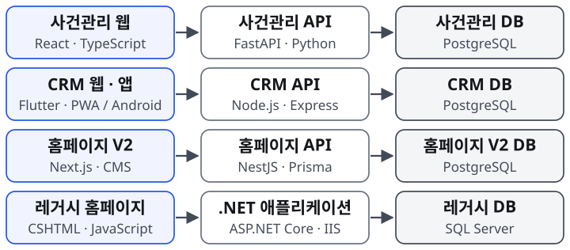
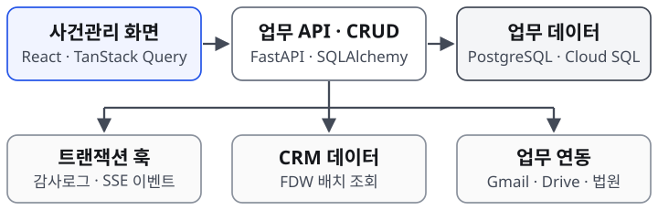
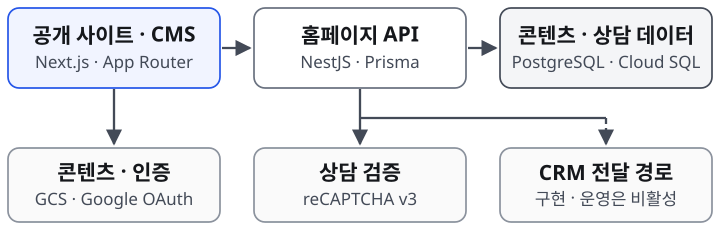
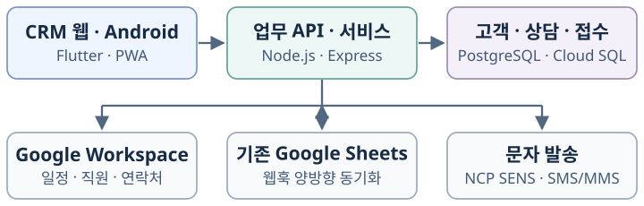
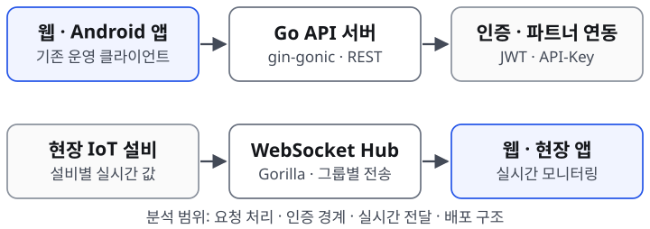

# 진솔 — 상세 경력기술서 (TMI)

**이름** 진솔
**직무** 프론트엔드 · 풀스택 개발자

**경력**
- 법무법인 법승 (law-win.co.kr) · 2026-01-19 – 현재
- 리얼타임테크 · 공간정보융합팀 · 인턴(2024-08–2025-02) → 사원(2025-03–2025-06)

**핵심 기술 스택**

- **Frontend**: React(TypeScript, Vite, TanStack Query/Table), Next.js(App Router), Flutter(Dart, PWA+Android)
- **Backend**: Node.js(Express), Python(FastAPI, SQLAlchemy, Pydantic), TypeScript(NestJS)
- **Database**: PostgreSQL(Cloud SQL), MySQL, `postgres_fdw`, JSONB/GIN 인덱스, 복합 인덱스 설계
- **Infra/DevOps**: GCP Cloud Run, Cloud Build, Cloud SQL, Secret Manager, Cloud Scheduler, Firebase Hosting, Certificate Manager/ALB
- **연동**: Google Workspace API군(OAuth2, Calendar, Admin Directory, People, Gmail, Drive), NCP SENS(SMS/MMS), 카카오톡 웹훅
- **(이전 경력)** Go(gin-gonic), Spring Framework, FFmpeg, Linux(Ubuntu) 운영

> **React 기반 사내 업무시스템과 Next.js 홈페이지·운영 CMS**를 개발하며, 공통 컴포넌트·상태관리·업무 UX·화면 디자인부터 API·DB·배포까지 연결합니다. 법무법인 법승에서는 **CRM·홈페이지 V2·데이터 이관**을 1인 풀스택으로 구축했고, **사건관리 앱**은 2인 팀에서 상담·문서·전자결재·정산 화면과 업무 로직, 인프라를 담당했습니다. 이전 직장에서는 CCTV 모니터링 유지보수, 기존 시스템 분석, 공장 센서 데이터 UI 개선을 수행했습니다.

### 전체 시스템 개관 (법무법인 법승)

**시스템 간 연동**: 사건관리↔CRM은 FDW·API, CRM↔Google Sheets는 웹훅으로 연결합니다. V2→CRM 비동기 전달은 구현 이력이며 운영 상태는 II절에 구분했습니다.

**운영 환경**: 신규 시스템은 GCP Cloud Run·Cloud SQL, 레거시는 Windows Server/IIS·SQL Server.

---

# 법무법인 법승 (2026-01-19 – 현재)

## I. 사내 사건관리 앱 (BS_CASE_MANAGEMENT) — 2인 팀 개발

- **기간**: 2026-06 착수 – 진행 중 (베타 운영: 대전 · 부산 · 청주 3개 지사)
- **기술스택**: React + TypeScript + Vite(TanStack Query, TanStack Table, shadcn/ui) / FastAPI(Python) + SQLAlchemy + Pydantic / PostgreSQL(Cloud SQL, `postgres_fdw`) / APScheduler / Google Gmail·Drive·Workspace API / GCP Cloud Run
- **시스템 개요**: 상담료 · 수발신 문서대장 · 전자결재 · 열람등사 · 계약/미수금 등 변호사 실무 전 과정을 통합 관리하는 사내 업무 도구. **2인 팀 개발**이며, 본인은 **상담 · 문서 · 전자결재 · 정산(계약/미수금) 도메인**과 **인프라/배포 전반**을 담당. CRM과 데이터를 연동해 사건 · 당사자 정보를 단일 원천으로 관리.

### 아키텍처

**핵심 흐름**: React 화면 → API 라우터 → CRUD → PostgreSQL. 변경사항은 SQLAlchemy 세션 훅에서 감사로그와 SSE 이벤트로 연결하고, 브라우저에서는 관련 쿼리 캐시를 갱신합니다. CRM 원격 데이터는 인라인 조인 대신 배치 조회합니다.

### 담당 업무 및 핵심 문제 해결 사례

**프론트엔드 A) 공통 DataTable·모바일 카드와 상태 공유**
- **문제와 설계**: 계약·미수금·상담료·열람등사 목록의 반복 구현을 TanStack Table 기반 공통 DataTable로 통합. `useTableColumnState`에서 컬럼 폭·순서·표시·정렬을 관리하고 `tableId`별 localStorage에 저장해 화면마다 사용자 설정을 유지.
- **반응형**: 공통 모바일 카드 셸을 목록 6종에 적용해 필터·페이지네이션·합계를 유지. 정렬 상태를 표 내부에서 페이지로 올려 데스크톱 표와 모바일 카드가 동일한 값·비교 함수를 공유하도록 개선.
- **근거**: [7/15](daily/7월/2026-07-15.md) `e89665a`, [7/22](daily/7월/2026-07-22.md) `c6fe47c`, [8/4](daily/8월/2026-08-04.md) `cea14fc`.

**프론트엔드 B) 결재 업무 UX·대시보드 화면 디자인**
- **업무 동선**: 결재 대기·완료·기안함 3탭과 `?tab=`을 연결해 새로고침·뒤로가기에도 선택을 유지. 알림에서 대기 목록 위로 문서 상세를 열어, 승인·반려 후 남은 업무를 이어 처리하도록 설계. 즉시 승인과 반려 사유 입력이 필요한 동작을 구분.
- **시각적 위계**: 대시보드를 월간 장부형 머리글, 경영 지표·업무 영역으로 재구성하고 색상 팔레트·KPI 타이포·위젯 테두리를 페이지 차원에서 통일.
- **근거**: [7/29](daily/7월/2026-07-29.md) `7f9eb8a`, `143d69a`, `7fdaea7`; [7/22](daily/7월/2026-07-22.md) `71eca40`, `b7b315d`.

**프론트엔드 C) SSE·쿼리 캐시와 React 렌더링 안정성**
- **서버 상태**: `fetch`·`ReadableStream` 구독으로 JWT를 인증 헤더에 전달하고 백오프·지터·탭 숨김 처리를 구현. SSE 변경 신호를 리소스별 queryKey 접두사와 연결하고 300ms 단위로 병합해 관련 목록·상세를 갱신.
- **렌더링 오류 해결**: 매 렌더마다 생성되는 기본 빈 배열의 참조 변경과 초기 데이터 미수신 처리를 분석. raw 응답과 렌더용 파생 배열을 분리하고 `undefined`와 빈 결과를 구분해 반복 렌더·첫 로드 전체 행 강조 오류를 해결.
- **근거**: [9/7](daily/9월/2026-09-07.md) `a346600`, [9/9](daily/9월/2026-09-09.md) `a2088a1`, `5bcd062`, `860b701`.

**1) FDW 원격 조인 병목 제거 — 응답시간 8초 → 0.05초 (약 160배)**
- **문제**: 상담료 '처리 대기' 목록 조회에서, CRM 데이터를 `postgres_fdw`로 노출한 `crm.*` 스키마와 로컬 테이블을 인라인 JOIN하는 쿼리가 8초 이상 소요.
- **원인 분석**: FDW 포린테이블은 원격 조인이 로컬 옵티마이저에 푸시다운되지 않아, JOIN이 걸릴 때마다 원격 테이블 전체를 끌어와 로컬에서 재필터링하는 구조였음.
- **해결**: "스케줄(사건) 선조회 → 이름/사무소 배치(batch) 조회" 구조로 재설계해 원격 인라인 조인 자체를 제거.
- **성과**: 응답시간 8초 → 0.05초 (약 160배 개선).

**2) 타입 불일치로 무효화된 인덱스 복구 — 1695ms → 109ms (약 15배)**
- **문제**: 사건목록 조회가 매 요청마다 약 4만 행 Seq Scan을 반복하며 1.7초 가까이 소요.
- **원인 분석**: `party_detail_local.party_key`(`text`)와 `cases`/`matters.party_key`(`character(8)`, bpchar) 간 타입 불일치로 PostgreSQL 옵티마이저가 기존 인덱스를 사용하지 못하고 있었음.
- **해결**: 조인 조건에 `::text` 명시적 캐스팅을 적용해 인덱스 사용 경로를 복원.
- **성과**: 1695ms → 109ms (약 15배). 기일 충돌 판정 기준도 `< 3600` → `<= 3600`(60분 경계 포함)으로 함께 정교화.

**3) SQLAlchemy 세션 훅 기반 "무수정(non-invasive)" 감사로그 + SSE 실시간 동기화**
- **문제**: 20초 폴링 기반 화면 갱신의 실시간성 부족. 엔드포인트가 늘어날 때마다 감사로그 · 실시간 알림 발행 코드를 수동으로 삽입해야 하는 구조라 신규 엔드포인트에서 누락 위험 상존.
- **해결**: SQLAlchemy `before_flush` / `after_flush` / `after_commit` 세션 훅으로 ORM 변경사항을 전역에서 자동 포착 — `before_flush`에서 변경 diff를 수집, `after_flush`에서 PK 확정 후 **같은 트랜잭션**에 기록해 롤백 시 로그도 함께 사라지는 원자성을 보장. 동일한 훅 구조를 실시간 이벤트 발행(`core/events.py`)에도 재사용해 엔드포인트 50곳을 일일이 수정하지 않고도 전역 커버.
- **실시간 브로커**: Redis/Pub-Sub 대신 이미 쓰던 Cloud SQL의 **Postgres `LISTEN/NOTIFY`** 를 채택(추가 인프라 비용 0). 전용 raw 커넥션을 별도 스레드에서 `select()`로 감시하고 `loop.call_soon_threadsafe`로 접속자별 asyncio 큐에 전달해, 동기 스택(psycopg2) 위에서 비동기 SSE 스트림을 구현. 프론트는 `EventSource` 대신 `fetch` + `ReadableStream`을 채택해 JWT가 쿼리스트링에 노출되지 않도록 처리.
- **성과**: 폴링 → 이벤트 기반 실시간 전환. 운영 실측(24시간) SSE 연결 620건 중 조기종료 0건.
- **운영 전용 장애 3건(로컬 재현 불가)**: ① `GZipMiddleware`가 최소 크기(1000B) 충족을 기다리며 SSE 신호를 무기한 대기하는 문제 → 경로 기반 판정으로 gzip 예외 처리. ② `is_disconnected()` 오판 → 애플리케이션 로그 대조로 실제 원인 규명 후 불필요한 체크 제거. ③ Firebase Hosting(Fastly CDN) 경유 시 스트리밍 버퍼링 → SSE만 Cloud Run에 직접 연결.

**실시간 변경 전파 — 4단계**

| 단계 | 처리와 설계 의도 |
|---|---|
| 1. 변경 수집 | API 수정 요청 → 세션 훅에서 diff 수집 → 업무 데이터와 감사로그를 같은 트랜잭션에 저장 |
| 2. 커밋 후 발행 | COMMIT 완료 후 PostgreSQL NOTIFY를 발행해 확정된 변경만 전달 |
| 3. 접속자별 전송 | LISTEN 브로커 → 접속자별 asyncio 큐 → SSE 스트림 |
| 4. 화면 반영 | 브라우저가 이벤트를 수신해 관련 TanStack Query 캐시를 무효화하고 다시 조회 |

**4) 전자결재(Approval) 시스템 — Gmail/Drive 위에 구축한 워크플로**
- **구현과 업무 전환**: 초기 Gmail 링크·서명토큰 결재를 구현한 뒤, [7/28](daily/7월/2026-07-28.md) 메일은 알림, 승인·반려는 앱에서 처리하는 흐름으로 정리. 등록·결재 요청·안내메일 발송을 분리하고 발송 전 결재자 변경을 지원. 참조자(Cc)는 JSONB(`cc_approver_keys`) + GIN 인덱스와 기존 `approval_status`를 사용해 상태 이원화를 방지.
- **시도와 롤백**: Gmail 안에서 승인·반려하는 **AMP for Email**을 구현했으나, 발신자 등록에 필요한 **DKIM·DMARC 미설정**을 확인해 관련 코드를 롤백. 이후 메일 알림과 인앱 결재로 업무 동선을 통합.
- **재설계**: 결재 흔적을 파일명 prepend 방식에서 **Google Drive 라벨 배지(대기/완료/반려) 자동 동기화**로 재설계해, Drive에서 파일을 열지 않고도 결재 상태를 바로 확인 가능하도록 개선.

**5) 열람등사(Record Request) 자동화 — '도과'의 재정의와 무인 알림**
- **문제**: 열람 · 등사 신청 후 "도과"(기한 경과) 여부를 사람이 직접 계산 · 추적해야 했음.
- **해결**: '도과'를 "등사일자 미등록 상태로 방치"로 재정의해, 발의일 + 7영업일 도달 시 자동 알림을 발송(등록/종결 시 알림 중단)하도록 설계. 공공데이터포털 **특일정보 API**로 공휴일을 판정해 영업일 계산에 반영하고, 외부 스케줄러 없이 **인앱 APScheduler(매일 10:00 KST cron)** 로 자동화, 알림 채널을 카카오톡 웹훅 단일 경로로 통합.
- **트러블슈팅**: 이 API 키가 배포 과정에서 두 번 유실된 사고를 겪음 — 키가 없어도 앱이 죽지 않고 빈 공휴일 목록으로 조용히 폴백하는 구조라 증상이 바로 드러나지 않았고(캐시된 연도 데이터로 당장은 정상 작동, 연도가 바뀌면 조용히 틀어지는 시한폭탄 구조), 묶음 `.env` 대신 전용 Secret Manager 시크릿으로 분리해 "빠뜨리면 배포 자체가 실패"하는 구조로 재발을 방지.

**6) 상담료 처리 대기 — 업무 흐름과 입력 상태 설계**
- 목록과 처리 대기를 좌우 분할·독립 스크롤로 구성하고, 대기 항목 선택 시 의뢰인·상담일·유형·메모·상담 변호사를 입력 폼에 자동 반영. 예약·접수·완료·취소·노쇼 필터와 처리 동선을 구분해 조회부터 등록까지 연결. [7/1](daily/7월/2026-07-01.md) `d12d74e`, `f7a5d61`.

**7) 요청 단위 자동 커밋 구조에서의 동시성 · 일관성 제어 (실제 메커니즘)**
- **설계·검토 이력**: 요청 단위 커밋 이후의 실행취소를 위해 역동작 클로저를 쌓는 Undo를 [7/28](daily/7월/2026-07-28.md)에 구현·검토. 적용 범위·복구 내용 표시·중복 실행 차단까지 다뤘으며, [7/31](daily/7월/2026-07-31.md) 기능 폐기 결정으로 종료.
- raw SQL 변경은 세션 훅이 감지하지 못하는 사각지대라 `record_manual()` 헬퍼로 같은 세션 · 같은 트랜잭션에 수동 기록해, "롤백돼도 로그만 남는" 유령 기록을 방지.
- **트러블슈팅**: 감사로그 대상을 6개 → 22개 테이블로 확대한 직후, `executemany` 배치 삽입에서 insert/update가 혼합돼 행마다 파라미터 키 집합이 달라지며 배치 자체가 실패해 요청 트랜잭션 전체가 롤백되는 장애 발생. 액션과 무관하게 항상 동일한 키 집합을 채우도록 수정해 해결.

**8) Cloud Run 빌드·배포 절차 표준화 — 명시적 이미지 배포와 응답 검증**
- **개선 배경**: 소스 기반 배포에서 의도한 루트 Dockerfile 대신 프론트엔드 정적서빙 이미지가 배포되어, API가 HTML을 반환하는 문제를 분석하고 이전 리비전으로 롤백. 당시 영향은 각각 27분·9분의 서비스 중단으로 확인.
- **조치와 가치**: 루트 Dockerfile 명시 → 이미지 빌드 → `--image` 배포 → 응답 본문·Content-Type 검증의 절차를 정립. 배포 성공 여부와 실제 API 응답의 정상 여부를 함께 확인하도록 만들고, 이후 신규 시스템에도 같은 절차를 적용.

**9) Cloud Run 실시간 서비스 설정 튜닝 (SSE 지원) + 프론트 · 백엔드 단일 서비스 통합 배포**
- `--timeout 3600`(기본 300초로는 SSE가 5분마다 강제 종료), `--concurrency 250`, `--cpu 1000m`(1 vCPU 미만이면 최대 동시성이 1로 강제돼 SSE와 양립 불가) 등 제약을 파악한 뒤 적용.
- 프론트(Vite 빌드)와 백엔드(FastAPI)를 **단일 Cloud Run 서비스**로 통합 배포(멀티스테이지 Docker), `--min-instances`를 서비스 레벨로 관리해 예열창(평일 08:30–19:30 KST) 토글이 리비전 재배포를 유발하지 않도록 설계.

**10) 자체 마이그레이션 프레임워크 및 스키마-모델 정합성 자동 검사**
- Alembic 대신 순번 기반 자체 마이그레이션 러너 운용. 계약일 기준 재설정 마이그레이션을 운영 DB에 무중단 적용, 회계 컬럼 재구조화(`consultation_fees`를 `fee_kind`+`fee_group_id`로 분리) 시 "구코드와 신코드가 동시에 적재되면 금액이 2배로 집계되는" 위험을 근거로 배포 순서를 명시적으로 고정.
- 계약 등록 API가 "마이그레이션은 반영됐는데 SQLAlchemy 모델 컬럼만 누락되어" 전면 500 장애가 발생한 사고를 계기로, 쓰기 스키마 필드가 모델 컬럼의 부분집합인지 자동 검사하는 정합성 체크 도구를 도입.

**11) 회계 데이터 정합성 감사 (읽기 전용 전수 대사)**
- 구글시트-앱 간 미수금 동기화가 **DB→시트 단방향**인 구조적 결함을 실측으로 규명. 월 차액 10,836,000원을 원인 2가지로 1원 단위까지 완전 분해.
- 조사 범위를 전 기간으로 확장해 DB 자체 미수금 중복 27쌍(43,818,000원)을 발견 — 전 과정 SELECT-only(운영 데이터 변경 0건)로 수행.

---

## II. 법무법인 홈페이지 V2 리뉴얼 (BS_MAIN_HOMEPAGE_V2) — 1인 풀스택

- **기간**: 2026-05 착수 – 진행 중
- **기술스택**: Next.js(App Router) + NestJS, TypeScript, Prisma, PostgreSQL(Cloud SQL, 레거시는 SQL Server), Turborepo, Tailwind, NextAuth/Google OAuth, GCP Cloud Run · Cloud Build · GCS
- **시스템 개요**: 레거시 ASP.NET/SQL Server 기반 대고객 홈페이지(승소사례 · 변호사소개 등 홍보용 공개 사이트)를 Next.js 기반으로 전면 리뉴얼. 공개 사이트부터 사내 운영용 어드민 CMS까지 **스크래치부터 1인 풀스택**으로 구축.

### 아키텍처

**상담 접수**: reCAPTCHA 검증과 카테고리 조회를 병렬 처리하고, CRM 전달은 응답을 기다리지 않는 비동기 경로로 구현했습니다. GCS 업로드와 Google OAuth는 화면에서 사용하는 연동입니다.

**연동 운영**: CRM 전달은 8/7에 비활성화했으며, [8/24 보고](daily/8월/2026-08-24.md)에서도 `CRM_FORWARD_ENABLED=false` 상태를 확인했습니다. 도식의 점선은 구현된 전달 경로를 뜻합니다.

**배포 경로**: 사용자 → Global ALB → Cloud Run. 인증서는 Certificate Manager로 관리하며, 콘텐츠와 상담 데이터는 SQL Server에서 이관한 PostgreSQL에 저장합니다.

### 담당 업무 및 핵심 문제 해결 사례

**프론트엔드 A) Next.js 서버·클라이언트 경계와 첫 화면 표시**
- 서버 `SiteHeader`에서 전화 인터랙션을 클라이언트 `HeaderCallButton`으로 분리. 서버 HTML에 투명하게 내려와 JS 실행을 기다리던 등장 연출은 CSS로 옮겨 콘텐츠가 먼저 표시되도록 개선하고 `prefers-reduced-motion` 설정에도 대응.
- **근거**: [8/7](daily/8월/2026-08-07.md) `7c4962b`, [9/2](daily/9월/2026-09-02.md) `6773899`.

**프론트엔드 B) 이미지 로딩·공통 화면 디자인**
- 현재 히어로 이미지에만 우선 로딩을 적용하고 다음 장면은 지연 로딩 유지. PNG 원본을 WebP로 사전 변환해 대표 이미지 용량을 **5.54MB → 589KB**로 축소.
- 전문센터의 히어로·본문·브랜드 스타일을 컴포넌트와 콘텐츠 데이터로 공통화. 관리자 목록은 모바일 카드·목록 행과 터치 영역, 삭제 버튼·저장 바 위치를 개선.
- **근거**: [8/26](daily/8월/2026-08-26.md) `ac81362`, `0fec4fc`; [6/1](daily/6월/2026-06-01.md) `389171c`; [9/2](daily/9월/2026-09-02.md) `7c24c77`, `8388008`.

**1) SQL Server → PostgreSQL 730만 건 데이터 이관**
- Turborepo 기반 프론트/백엔드 모노레포 뼈대 구축과 함께, 레거시 SQL Server 데이터 **약 730만 건**을 PostgreSQL(Cloud SQL)로 이관 완료.

**2) 상담 접수 API — `Promise.all` 병렬 처리 + fire-and-forget — 콜드스타트 대기 4초 제거**
- **문제**: 상담 접수 시 reCAPTCHA 검증(구글 API 왕복)과 카테고리 조회(DB)가 순차 실행되어 응답 지연, 콜드스타트 시 최대 4초 대기.
- **해결**: `Promise.all`로 두 작업을 병렬화해 대기시간을 겹치고(`backend/consult.service.ts`), CRM 요청함 전달은 결과를 기다리지 않는 **fire-and-forget**으로 전환 — CRM 측 장애가 홈페이지 상담 접수 자체를 막지 않도록 장애를 격리.
- **성과**: 콜드스타트 최대 4초 대기 제거.

**3) SEO/AEO — 검색 · 답변엔진(AI) 양쪽에 최적화**
- **레거시 주소 보존 이전**: 옛 주소(`/{지역}/wincasedetail`)를 지역 · ID 그대로 보존한 채 V2 경로로 301 이전, 페이지 자기 canonical 위임 처리(홈으로 canonical이 흡수되던 버그 해소).
- **사이트맵 정리**: 2024년 옛 주소 **2,328건**이 담긴 정적 sitemap을 제거하고 동적 sitemap으로 통합.
- **답변엔진 엔티티 혼동 대응**: Perplexity · Gemini · 네이버 CUE 등 AI 답변엔진이 법인을 다른 개체와 혼동하는 문제에 대응해, `LegalService` JSON-LD에 공식 SNS와 지사 10곳의 네이버 플레이스 `sameAs`를 주입. 칼럼 · 사례의 저자를 담당 변호사(`Person`)로 귀속해 E-E-A-T(전문성 · 권위 · 신뢰성) 신호를 강화.

**4) 보안 — 상담자 개인정보 · 어드민 접근 통제**
- 권한 없는 어드민 계정에는 상담 내용 **PII 마스킹** 처리. 전역 보안 헤더(클릭재킹 · MIME 스니핑 방어) 적용, 상담 접수 API에 **IP 기준 빈도 제한**. **reCAPTCHA v3** 봇 차단 로직을 구글 장애 시 fail-open(통과)이 아니라 **fail-closed(차단)** 로 전환해 봇 유입 리스크를 줄임. 어드민 로그인을 Google 전용으로 일원화.

**5) CMS — 어드민 콘텐츠 관리 기능**
- 예약 발행(발행 시각 도래 전 404 차단), 이미지 드래그 업로드(로컬 → GCS 직접 업로드), 자동 목차(TOC) 생성, 20MB PDF 첨부, 최대 1만 건 CSV 다운로드(한글 인코딩 깨짐 방지 + 개인정보 마스킹). Google Workspace **역할 기반 인증 + 하이브리드 폴백**으로 어드민 계정 관리를 일원화.

**6) Cloud SQL 보안 7항목 전수 점검 및 리스크 판단**
- 삭제 보호 비활성(백업 7일치와 함께 영구 삭제될 수 있는 상태) 즉시 조치, 평문 접속 허용 구간을 `ENCRYPTED_ONLY`로 전환(Cloud Run이 커넥터 소켓 경유임을 사전 확인해 운영 무중단 보장).
- 반대로, **멀티리전 복제는 의도적으로 미실행** — 한국 GCP 리전이 서울 하나뿐이라 복제본이 일본에 놓여 상담자 개인정보 국외이전이 되는 리스크를 근거로 보류. "경고를 없애는 조치"와 "리스크를 새로 만드는 조치"를 구분해 판단.
- **부작용 대응**: SSL 강제 조치 직후 마이그레이션 도구 12개가 인증서 검증 방식 차이로 파손된 것을 실측 확인 후 libpq 호환 플래그로 수정.

**7) Cloud SQL 커넥터 순간 장애에 대한 앱 레벨 내결함성**
- **문제**: Cloud SQL 커넥터가 순간 타임아웃될 때 `PrismaService.onModuleInit`이 재시도 없이 예외를 던져 Nest 부팅 자체가 실패 → Cloud Run이 인스턴스를 `exit(1)`로 종료 → STARTUP probe 실패로 6분 39초 전면 500 장애.
- **해결**: 기동 시 0.5초–8초 간격 5회 재시도, 재시도 소진해도 예외를 던지지 않고 기동을 이어가 DB 복구 시 자동 재연결하도록 변경.

**8) 배포/도메인 컷오버 인프라**
- Cloud Run 도메인 매핑이 서울 리전을 지원하지 않음을 확인한 뒤, 글로벌 외부 로드밸런서(ALB, 고정 IP) + Certificate Manager(DNS Authorization 방식 인증서)로 경로 전환 — 다운타임 0으로 컷오버 완료.
- Kaniko → BuildKit 빌드 전환으로 프론트 빌드시간 3분 4초 → 2분 23초 단축. `.gcloudignore` 적용으로 배포 업로드 용량 **7.6GB → 115MB**로 축소.
- 레거시 GSC 미색인 17.8만 건 원인 분석 — 필터 조합 URL이 크롤 예산을 소진하는 구조적 문제를 확인해 `robots.ts`로 차단.

---

## III. 사내 CRM (BS_CRM) — 1인 풀스택

- **기간**: 2026-01 착수 – 진행 중 (정식 오픈 2026-05)
- **기술스택**: Node.js(Express) 백엔드 + Flutter(Dart) 클라이언트(PWA + Android) / Google Sheets(Apps Script) → MySQL → PostgreSQL(Cloud SQL) / Google Workspace API 연동
- **시스템 개요**: 전국 10개 지사의 고객 유입 → 변호사 배정 → 상담 예약 → 문자 안내로 이어지는 전 과정을 통합 관리하는 맞춤형 CRM. **스크래치부터 1인 풀스택으로 구축**(API 54개, 16개 테이블, 약 49,000 LOC 규모).

### 아키텍처

**데이터와 연동**: 고객·상담·접수 정보를 PostgreSQL에서 관리합니다. 홈페이지 접수용 요청함 연동 경로를 CRM API에 구현했고, 사건관리는 CRM API 및 FDW로 관련 정보를 조회합니다. 데이터 저장소는 Google Sheets → MySQL → PostgreSQL 순서로 전환했습니다.

### 담당 업무 및 핵심 문제 해결 사례

**1) Google Sheets(Apps Script) → Cloud SQL → PostgreSQL — CRM의 시작점을 직접 이관**
- **배경**: CRM 구축 이전, 전 직원이 구글시트에 당사자 · 상담 · 문자 기록을 수기로 관리하고 있었음.
- **구현**: 1차로 당사자 · 상담 · 문자/전화 등 **약 9.8만 건**을 Cloud SQL로 이관하는 스크립트를 작성해 초기 적재. 이후 **Apps Script 트리거 → 웹훅 → DB 반영**의 실시간 양방향 동기화 구조를 자체 구축해, 신규 CRM과 기존 구글시트 워크플로가 과도기 동안 공존하도록 설계. 최종적으로 MySQL(Cloud SQL)을 거쳐 PostgreSQL(Cloud SQL)로 이관까지 전 과정을 단독 수행.

**2) [성능] 서브쿼리 480개 제거 + 복합 인덱스 + `Promise.all` 병렬처리**
- **문제**: 당사자 목록 조회가 행 단위 서브쿼리 구조라, 페이지당 최대 480개의 서브쿼리가 발생해 조회 속도 저하 및 무한 로딩 현상 발생.
- **해결**: 서브쿼리 구조를 `LEFT JOIN`으로 통합해 재작성. 상태(`status`)와 등록일(`created_at`)에 **복합 인덱스**를 추가해 목록 조회의 주요 필터 조건을 인덱스로 커버. 데이터 조회 쿼리와 카운트(전체 건수) 쿼리를 `Promise.all`로 병렬 처리해, 두 쿼리의 순차 대기 시간을 겹쳐 화면 대기 시간을 단축.

**3) [동시성] Cloud Run 다중 인스턴스 스케줄러 중복 실행 — MySQL Named Lock(`GET_LOCK`)**
- **문제**: Cloud Run이 다중 인스턴스로 확장될 때, 동일한 자동 동기화 스케줄러(Google Admin 동기화 등)가 인스턴스마다 중복 실행되어 데이터 중복 처리 위험 발생.
- **해결**: Redis 등 추가 인프라 도입 없이, **MySQL Named Lock(`GET_LOCK`)** 으로 스케줄러 실행을 인스턴스 간 상호 배제(mutual exclusion) 처리 — 하나의 인스턴스만 락을 획득해 실행하고 나머지는 스킵하도록 구현. 이는 SQL 세션에 종속된 어드바이저리 락으로, 별도 락 테이블이나 외부 캐시 없이 DB 커넥션만으로 분산 잠금을 구현한 방식.
- **함께 처리**: 직원 식별 기준을 이름에서 **`employee_key`** 로 통일하고, 레거시 데이터에는 폴백 로직을 적용해 서비스 중단 없이 식별체계를 전환.

**4) 동시 접수 처리 충돌 방지 — Claim(점유) 기반 동시성 제어**
- **문제**: 다수 직원이 동일 홈페이지 접수 건을 동시에 열람 · 처리하면서 데이터가 서로 덮어써지는 충돌 발생.
- **해결**: 접수 처리 시작 시점에 해당 건을 즉시 점유(claim) 상태로 전환하는 컬럼/로직을 추가하고, **10분간 미조작 시 자동 회수**되는 타임아웃을 설계 — 애플리케이션 레벨의 **낙관적 점유(claim) 방식**을 채택해, 다른 직원 화면에는 "처리 중" 잠금 표시로 즉시 충돌을 차단.

**접수 점유 흐름**

| 상황 | 처리 |
|---|---|
| 직원 A가 처리 시작 | 접수 건에 claimed_by·claimed_at을 기록하고 처리 화면 진입 |
| 직원 B가 같은 건 접근 | 점유 상태를 확인해 '처리 중'으로 표시하고 수정 제한 |
| 10분간 미조작 | 점유가 만료되어 다른 직원이 이어서 처리 가능 |

**5) Google Workspace 연동 — Calendar / Admin Directory / People API**
- 상담 등록 · 수정 · 삭제 시 Google Calendar 이벤트를 자동 반영(다중 상담사 지원), 지사별 고유 캘린더 매핑. Google Admin Directory · People API로 직원 계정 동기화, 고객 연락처 저장, 일정 생성을 자동화.
- 직원 식별체계를 이름 기반에서 `employee_key`(고유키)로 전면 통일 — 개명 · 표기 흔들림에도 안전하게 연결.

**6) NCP SMS/MMS 발송 — 바이트 기준 타입 자동 판정 + 예약 · 템플릿 시스템**
- 문자 길이를 글자 수가 아닌 **실제 바이트 수** 기준으로 SMS/LMS/MMS 타입을 자동 판정해 발송 오류를 방지. 예약 전송과 템플릿 시스템을 자체 구축. MMS 이미지 자동 변환(PNG→JPEG, 비율 유지 최적화)과 GCS 인증 폴백 처리를 구현.

**7) 안정성 — DB 자동 재연결, Rate Limit, OAuth 화이트리스트**
- MySQL/PostgreSQL 커넥션 끊김 시 자동 재연결 및 503 응답 변환 처리로 순간 장애가 전체 장애로 번지지 않도록 방어. 별도 라이브러리 없이 **직접 구현한 Rate Limit** 미들웨어로 로그인 · 문자 발송 등 민감 API에 호출 제한 적용. 도메인 화이트리스트(`@law-win.co.kr`) 기반 OAuth로 인가되지 않은 계정의 접근을 원천 차단.

**8) Flutter 클라이언트 — PWA + Android 크로스플랫폼**
- GoRouter 기반 라우팅, Google 네이티브 로그인(`google_sign_in`), Android 빌드환경(Java 17 + AGP 8.2.1) 대응. PDF/PNG 문서 출력(`printing`/`pdf` 패키지 + 한글 폰트 임베딩). 크로스플랫폼 빌드 형상관리: OS별 개행문자 차이로 발생하는 가짜 diff를 `.gitattributes`/`.gitignore`로 제거.

> **회고** — Sheet 기반 레거시를 RDBMS로 전환하며 성능 · 동시성 · 보안을 1인이 전담했습니다. 4개월간 643개 커밋 중 SMS · 타임존 관련 수정이 가장 많았는데, UTC↔KST 변환과 외부 발송 API의 엣지 케이스를 다루며 "기능 구현보다 운영 환경의 디테일이 더 어렵다"는 점을 체득했습니다.

---

## IV. 법무법인 법승 공식 홈페이지(레거시) 유지보수

- **기간**: 2026-01 – 진행 중
- **기술스택**: ASP.NET Core 6.0 · CSHTML · Vanilla JavaScript/CSS · SQL Server · Windows Server/IIS · FileZilla
- **담당 범위**: 기존 대고객 홈페이지의 화면 개선, 검색엔진 대응, 백엔드 API 개발, 소스 이관 및 배포 환경 분석. 외주 소스를 사내 저장소로 이관하고 운영 절차를 문서화해 직접 유지보수할 수 있는 기반을 마련.

### 담당 업무 및 핵심 문제 해결 사례

**1) 변호사 상세 페이지 진입 지연과 모바일 레이아웃 개선 — 2026-01**
- **문제**: 변호사 상세 페이지 진입에 2~3초 지연이 발생하고, 모바일에서 검색창·소개 영역·이동 화살표가 겹치는 문제가 있었음.
- **조치와 결과**: Chrome DevTools로 `member.cshtml`의 불필요한 prefetch 스크립트와 이벤트 핸들러를 찾아 정리해 진입 지연을 해소. 절대 좌표에 의존하던 화면에는 Flex 레이아웃과 `max-width` 미디어 쿼리를 적용해 모바일 요소 간 간섭을 수정.
- **근거**: [1월 3주차 업무 회고](weekly/1월/1월%203주차.md).

**2) 검색용 URL 정리와 뒤로가기 상태 보존 — 2026-02**
- **문제**: 상세 페이지 URL에 `ReturnUrl` 쿼리 파라미터가 노출되어 주소 정리가 필요했으며, 단순 제거 시 이전 목록으로 돌아가는 경로가 유실될 수 있었음.
- **조치와 결과**: URL에서 해당 파라미터를 제거하고 Web Storage에 복귀 경로를 저장·복원하도록 변경해 검색용 주소 정리와 기존 탐색 동작을 함께 유지.
- **근거**: [2월 3주차 업무 회고](weekly/2월/2월%203주차.md).

**3) 전국 10개 지점 사이트맵 갱신 자동화 — 2026-03**
- **작업과 가치**: Playwright로 전국 10개 지점의 콘텐츠를 크롤링하고 XML 사이트맵을 갱신하는 자동화 스크립트를 구축. `robots.txt`에 지역별 사이트맵을 등록해 지점별 콘텐츠 갱신을 검색엔진에 전달할 수 있는 관리 경로를 정리.
- **근거**: [3월 2주차 업무 회고](weekly/3월/3월%202주차.md).

**4) 외주 ASP.NET 소스 이관과 유지보수 구조 문서화 — 2026-04**
- **작업**: 외주 개발 ASP.NET Core 6.0 소스를 사내 저장소로 최초 이관하고, WEB/BLL/DAL 3계층의 역할과 빌드·업로드 배포 절차를 문서화.
- **결과**: 기존 시스템을 사내에서 분석·수정하고 배포 절차를 확인할 수 있는 유지보수 기반을 마련.
- **근거**: [4월 2주차 업무 회고](weekly/4월/4월%202주차.md).

**5) 외부 업체 SEO 데이터 업로드 API와 URL 매칭 개선 — 2026-04**
- **작업**: `POST /api/seo/upload`와 `X-API-KEY` 인증을 구현하고, `wwwroot/seo` 디렉터리가 없을 때 자동 생성하도록 방어 처리.
- **고도화**: URL별 문구 조회에 쿼리스트링·후행 슬래시 정규화를 적용해 주소 표기 차이에도 일관되게 매칭되도록 개선. 업로드 데이터는 메모리에 캐싱하고, 빌드 시 `publish_output` 폴더가 중복 포함되지 않도록 산출물 규칙도 정리.
- **근거**: [4월 3주차](weekly/4월/4월%203주차.md), [4월 4주차 업무 회고](weekly/4월/4월%204주차.md).

**6) HTTP 500.30·500.31과 DB 연결 오류의 원인 분리 — 2026-04**
- **문제**: 기존 홈페이지의 500 계열 접속 오류에 대해 애플리케이션 코드와 서버 환경 중 어느 계층을 조치해야 하는지 판단이 필요했음.
- **분석과 결과**: 500.30·500.31은 서버 디스크 부족에 따른 호스팅 번들(DLL) 설치 누락, 일반 500은 `appsettings.json`의 DB 주소 매핑 오류로 원인을 분리. 디스크 확보·번들 재설치와 DB 설정 수정 등 후속 조치의 범위를 구체화.
- **근거**: [4월 4주차 업무 회고](weekly/4월/4월%204주차.md). 해당 기록에서는 원인 규명까지 확인되며, 서버 복구는 후속 과제로 남아 있음.

**7) FileZilla 업로드와 IIS 오류 대응 절차 정리 — 2026-05**
- **작업과 가치**: 반복되는 FileZilla 업로드 이슈와 DLL 버전 불일치 등 IIS 500.x 오류의 대처 방법을 README에 정리해, 배포 시 확인할 항목과 팀 내 트러블슈팅 기준을 문서화.
- **근거**: [5월 4주차 업무 회고](weekly/5월/5월%204주차.md).

---

## V. GCP 인프라 / DevOps — 여러 시스템 공통 적용 원칙

- **배포 안전 원칙 전파**: 사건관리 앱에서 발생한 `--source=.` 오배포 장애를 계기로 "빌드 · 배포 2단계 분리 + 배포 후 응답 본문 검증"을 원칙화하고, 이후 신규 시스템(사내 포털)에도 선제 적용.
- **Cloud Scheduler 기반 예열/해제 스케줄링**: 서비스 레벨 `--min-instances` + Cloud Scheduler로 업무시간(08:30–19:30 KST)만 인스턴스를 예열하고, 리비전 재배포 없이 토글되도록 설계.
- **시크릿 관리 원칙**: 묶음 `.env` 대신 전용 Secret Manager 시크릿으로 분리해 "빠뜨리면 배포 자체가 실패"하는 구조로 전환.
- **비용 우선 실측 원칙**: 리전별 Cloud Run 요금 티어(서울 = Tier 2), egress 단가 등을 "주석에 적힌 값"이 아니라 공식 문서 · 실측으로 재확인해 웹소켓/SSE/폴링 등 기술 선택에 직접 반영.

---

# 리얼타임테크 (공간정보융합팀)

인턴(2024-08–2025-02) → 사원(2025-03–2025-06). 일학습병행제 기반으로 실무 프로젝트 및 유지보수 업무를 수행하며, 월 단위 평가로 실무 이해도와 기술 숙련도를 검증받음.

## VI. ETRI(한국전자통신연구원) — CCTV 실시간 모니터링 웹서비스 유지보수

- **기간**: 2025-03 – 2025-06 (사원)
- **기술스택**: Node.js, FFmpeg, Linux(Ubuntu)
- **서비스/용도**: 공사 현장의 CCTV 스트림을 웹 UI에서 실시간으로 모니터링하는 관리 시스템.

**핵심 업무**
- Node.js 기반 CCTV 실시간 모니터링 웹 서비스 유지보수.
- FFmpeg 스트림 처리 로직을 Windows / Ubuntu 환경별로 분기 적용.
- Ubuntu 환경에서 FFmpeg를 리눅스 스크립트 형태로 실행 · 배포하여 운영 환경 대응.

## VII. KOGAS(한국가스기술공사) — 신규 개발 착수를 위한 기존 시스템 코드 분석

- **기간**: 2025-03 – 2025-06 (사원)
- **직무 성격**: 가스 누수 의심 등 고객 이벤트 요청 → 직원 점검 → 운영자 현황 확인으로 이어지는 앱의 **신규 개발에 앞서, 기존에 운영 중이던 시스템의 코드 흐름 전체를 분석**하는 역할.

> 아래 아키텍처와 기술 상세는 **본인이 구현한 것이 아니라**, 신규 개발 설계 근거자료를 만들기 위해 기존 운영 시스템(Go 백엔드 + JavaScript 프론트엔드)을 직접 읽고 분석해 파악한 내용입니다.

### 분석 대상 시스템 구조

**분석한 배포 구조**: Docker 멀티스테이지 빌드로 생성한 Go 바이너리를 Linux systemd 서비스로 운영. 아래 항목은 기존 시스템을 읽고 파악한 내용이며 본인의 신규 구현 범위와 구분합니다.

### 분석을 통해 파악한 내용

- **백엔드 로직 이해**: Go(gin-gonic) 기반 REST API 서버에서 가스 점검 이벤트(Order/Task/Target) 생성 · 조회 · 수정 로직과, 점검 프로세스 유형(PCM/SCM/COM/OMS 4종)마다 "처리 시작 → 상태 갱신 → 재오픈 → 목표값 저장"이 반복되는 API 패턴을 파악.
- **프론트엔드 구조 이해**: JavaScript(CommonJS) 기반 프론트엔드(서버렌더링 템플릿 + vanilla JS)의 코드 구조를 파악해 점검 요청 · 응답 UI 상호작용 로직을 이해.
- **연동 관계 분석**: 프론트엔드 ↔ 백엔드 REST API 연동 관계를 분석하고 API 요청/응답 흐름을 검증.
- **인증 체계 확인**: 사용자 JWT(쿠키 기반) + 파트너사(MD/TYL) API-Key + 특정 민감 엔드포인트 대상 토큰 화이트리스트로, 신뢰 경계가 3단으로 분리된 인증 구조임을 확인.
- **실시간 처리 구조 확인**: Gorilla WebSocket 기반 허브가 설비(IOT) 단위로 클라이언트를 그룹핑해 데이터를 브로드캐스트하는 구조, 논블로킹 전송(`select`/`default`) 처리 방식을 코드 레벨로 확인.
- **배포 구조 확인**: Docker 멀티스테이지 빌드(정적 바이너리) + Linux systemd 서비스로 운영되는 배포 방식을 확인.
- **문서화**: 디렉터리 구조와 컴포넌트 단위 코드 흐름을 분석해 유지보수성과 전체 코드 구조에 대한 이해를 신규 개발팀에 전달할 수 있도록 정리.

## VIII. Jubix — 공장 센서데이터 웹 유지보수 · UI 개선

- **기간**: 2024-10 – 2025-02 (인턴)
- **기술스택**: Spring Framework, PostgreSQL, JavaScript, CSS
- **서비스/용도**: 공장 현장 데이터(온도 · 습도 · 풍향 등)를 시각화 · 관리하는 B2B 운영 웹 시스템.

**핵심 업무**
- PostgreSQL 센서 데이터 기반으로 Spring Framework 서비스의 데이터 출력 · 가공 로직 수정 및 화면 연동 구조 개선.
- JavaScript/CSS로 화면 이벤트 · UI 기능 개선, 레거시 코드 리팩토링으로 유지보수성 · UI 안정성 향상.
